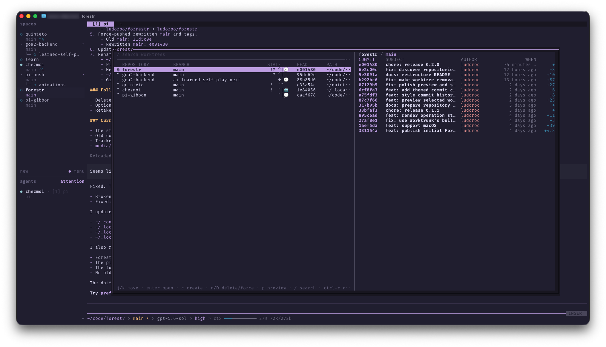

A [Herdr](https://herdr.dev/) plugin that manages Git branch worktrees from one fast, modal `fzf` popup — list, open, create, and safely remove worktrees across every repository Herdr knows about, **without leaving your keyboard**.

- Plugin ID: `ludoroo.forestr`
- Action: `ludoroo.forestr.open`
- Version: `0.2.0`
- Platforms: Linux, macOS



## Key Design Principle

**Every worktree, one place — regardless of repository size.** Forestr gives you one consistent interface for the worktrees behind all of your Herdr workspaces, from small repositories to large monorepos. Fast operations stay immediate, while potentially expensive enrichment and approved removals run asynchronously so large repositories do not make the interface feel stuck. Forestr drives your backend of choice — native Git or [Worktrunk](https://worktrunk.dev/) — without hiding or bypassing its checks and hooks.

## Features

### One popup, every repository

Forestr discovers repositories through Herdr workspace metadata, the pane working directory of plain workspaces, and the repository you launched it from, then lists their worktrees in a single table: repository, branch, state, `HEAD`, and path. The row for your current checkout renders instantly; the rest stream in without blocking.

### Open or create in one keystroke

`Enter` opens the selected worktree and focuses (or creates) its Herdr workspace. `c` starts a repository-first create wizard: pick a repository, pick a local or remote branch — or type a new one — and Forestr materialises the checkout and jumps to it.

### Durable, interruption-safe removal

`d` / `D` **approve** a removal and hand it to a detached worker that survives closing the popup, pressing `q`/`Esc`, Ctrl+C, and workspace switches. Progress shows in the footer while it runs. The result lands in the footer if the popup is still open, or arrives as a Herdr notification if it isn't.

If a removal is interrupted after Git has already mutated (for example a large deletion killed mid-way), the next launch reconciles it against `git worktree list` and closes only the exactly matching stale workspace — never a worktree that is still registered, still on disk, or unverifiable.

### Source-aware workspace handling

Removing the worktree you launched Forestr from focuses its parent workspace **before** any mutation starts, so you are never left inside a checkout that is being deleted.

### Commit-log preview

`p` toggles a bounded, fixed-width commit history for the selected worktree (its own `HEAD` ancestry only, capped at 25 commits) with compacted change statistics. It moves below the list when the side panel is too narrow.

### Follows your Herdr theme

The popup draws with your terminal's default colours and ANSI palette, so it matches whatever Herdr theme you run — no colour configuration needed.

### Pluggable backends

`backend = "auto"` uses [Worktrunk](https://worktrunk.dev/) (`wt`) when available and native Git otherwise.

| Backend | Highlights |
| --- | --- |
| **Git** | Pure porcelain. Exact local/remote branch materialisation, sibling checkout paths (`.<repository>-<branch>`), conservative deletion with unmerged-branch retention. |
| **Worktrunk** | Delegates switch/create/remove to `wt`, including clobber-create and relocation-aware operations. Background enrichment adds Worktrunk's seven-slot status symbols; each icon is overridable via `status_icon_*`. Hooks stay enabled. |

## Install

```bash
herdr plugin install ludoroo/forestr
```

Then open Forestr from Herdr's action picker with `ludoroo.forestr.open`.

### Requirements

Herdr does not install plugin dependencies; make sure these are on your `PATH` (Linux or macOS):

| Dependency | Notes |
| --- | --- |
| Herdr `>= 0.9.0` | |
| Bash `>= 4` | |
| Git, `jq`, `curl` | |
| `fzf` `>= 0.74` | |
| Worktrunk (`wt`) | *optional* — enables the Worktrunk backend |

Removal workers are detached with `setsid` (part of util-linux on Linux) or the system Perl on macOS; both are present by default.

On macOS:

```bash
brew install bash jq fzf
```

Forestr searches `PATH` plus common Homebrew prefixes. Explicit `BASH_BIN`, `HERDR_BIN`, `FZF_BIN`, `GIT_BIN`, `JQ_BIN`, `CURL_BIN`, and `WORKTRUNK_BIN` overrides are honoured.

## Remove

```bash
herdr plugin uninstall ludoroo.forestr
```

Removal records under `${XDG_STATE_HOME:-$HOME/.local/state}/forestr/` are left in place as an audit trail; delete them manually if you no longer want them.

## Keys

| Key | Action |
| --- | --- |
| `j` / `k`, `g` / `G` | Move down/up, first/last |
| `Enter` | Open or choose the selected item |
| `c` | Start the create wizard |
| `d` / `D` | Remove / force-remove the selected worktree (approval is final) |
| `p` | Toggle the commit-log preview |
| `/` | Search |
| `Ctrl-R` | Refresh |
| `h` / `Esc` | Back / close |
| `q` | Quit |

Create wizard, source screen: `l` / `r` / `b` switch between local, remote, and both branch scopes; `n` types an exact new branch name; `C` requests clobber-create (Worktrunk only).

Every key is remappable in `config.toml`; defaults are in [`config.example.toml`](config.example.toml).

## Configuration

```bash
herdr plugin config-dir ludoroo.forestr
```

Copy [`config.example.toml`](config.example.toml) to `config.toml` in that directory and change only what you need. Configuration is parsed as data — never sourced as shell.

| Setting | Default | Purpose |
| --- | --- | --- |
| `popup_width` / `popup_height` | `90%` / `85%` | Popup size in cells or percent |
| `backend` | `auto` | `auto`, `git`, or `worktrunk` |
| `create_scope` | `local` | Branch scope offered first in the wizard |
| `create_base` | `""` | Base ref for new branches (Git backend) |
| `enrich_backend` | `true` | Worktrunk status enrichment |
| `worktrunk_enrichment_collection_timeout_ms` | `5000` | Passed to Worktrunk's `list.timeout-ms` |
| `worktrunk_enrichment_concurrency` | `2` | `1` or `2` parallel enrichment jobs |
| `status_icon_*` | see example | Per-slot Worktrunk status glyph overrides |
| `key_*` | see example | Key bindings |

## How Removal Works

1. **Approve** — `d`/`D` verifies the row is a registered worktree, snapshots the matching Herdr workspace, and takes an atomic per-worktree lock so the same checkout cannot be queued twice.
2. **Detach** — A worker starts in its own OS session from the repository's primary checkout. Herdr shutting down the popup terminal cannot reach it.
3. **Mutate** — The backend runs with hooks and safety checks intact (`wt remove --foreground --format=json` or native Git). Its JSON result, including branch outcomes such as `retained_unmerged`, is parsed rather than inferred from the exit status.
4. **Prove** — Regardless of what the backend reported, Forestr probes Git from the primary checkout. Only *unregistered + path gone* counts as removed; *registered*, *present*, or *unknown* retains the worktree.
5. **Reconcile** — The Herdr workspace is closed only if its ID and checkout path still match the snapshot, after a second probe. Results are persisted and notified.
6. **Recover** — On every launch, queued/running records whose exact worker (PID, start time, and argv) is gone are reconciled with the same rules. Recovery only observes; it never re-runs a destructive command.

There is intentionally **no post-approval cancel key**: neither backend exposes a reliable boundary between "safe to abort" and "already irreversible".

## Git Safety

The native Git backend:

- never removes the primary worktree, runs `git worktree prune`, deletes arbitrary directories, or rewrites unrelated refs;
- refuses path collisions, ambiguous or missing refs, cross-repository paths, and selections that changed since the list was rendered;
- creates exact tracking branches for remote selections and does not infer tracking for typed names;
- uses normal deletion for `d` (retaining unmerged or checked-out branches with a warning) and force deletion only for explicit `D`;
- leaves a freshly created checkout in place if post-create verification fails, so it can be inspected rather than destructively rolled back.

Worktrunk operations keep Worktrunk's own hooks and checks; Forestr never passes `--no-hooks` or `--yes`.

## Known Limitations

- **Removal cannot be cancelled once approved.** Close the popup freely; the job still completes and reports. This is a deliberate safety trade-off (see above).
- **Closing an active workspace defers to Herdr.** If you navigate back into a worktree that is being removed, Herdr — not Forestr — chooses the next focused workspace when it closes.
- **Removal records are not pruned automatically.** They are small JSON/log files kept as an audit trail under `~/.local/state/forestr/removals`.

## License

[MIT](LICENSE)
